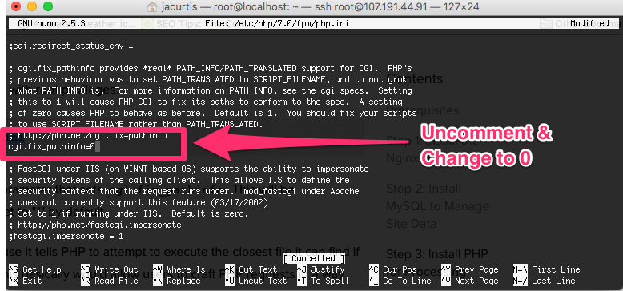

# How-To-Install-Nginx-on-Ubuntu

### Introduction

Nginx is one of the most popular web servers in the world and is responsible for hosting some of the largest and highest-traffic sites on the internet. It is more resource-friendly than Apache in most cases and can be used as a web server or reverse proxy.

In this guide, you’ll learn how to install Nginx on your Ubuntu 18.04 server and about important Nginx files and directories.

## Step 1 – Installing Nginx

Since Nginx is available in Ubuntu’s default repositories, it is possible to install it from these repositories using the apt packaging system.

Since this may be your first interaction with the apt packaging system in this session, update the local package index so that you have access to the most recent package listings. Afterward, you can install nginx:

```shell
$ sudo apt update
$ sudo apt install nginx
```

After accepting the procedure, apt will install Nginx and any required dependencies to your server.

## Step 2 – Adjusting the Firewall

Before testing Nginx, the firewall software needs to be adjusted to allow access to the service. Nginx registers itself as a service with ufw upon installation, making it straightforward to allow Nginx access.

List the application configurations that ufw knows how to work with by typing the following:

```shell
$ sudo ufw app list
```

Your output should be a list of the application profiles:

```console
Output
Available applications:
  Nginx Full
  Nginx HTTP
  Nginx HTTPS
  OpenSSH
```

This list displays three profiles available for Nginx:

- **Nginx Full:** This profile opens both port 80 (normal, unencrypted web traffic) and port 443 (TLS/SSL encrypted traffic)
- **Nginx HTTP:** This profile opens only port 80 (normal, unencrypted web traffic)
- **Nginx HTTPS:** This profile opens only port 443 (TLS/SSL encrypted traffic)

It is recommended that you enable the most restrictive profile that will still allow the traffic you’ve configured. Since you haven’t configured SSL for your server yet in this guide, you’ll only need to allow traffic on port 80.

You can enable this by typing the following:

```shell
$ sudo ufw allow 'Nginx HTTP'
```

Then, verify the change:

```shell
$ sudo ufw status
```

You should receive a list of HTTP traffic allowed in the output:

```console
Output
Status: active

To                         Action      From
--                         ------      ----
OpenSSH                    ALLOW       Anywhere
Nginx HTTP                 ALLOW       Anywhere
OpenSSH (v6)               ALLOW       Anywhere (v6)
Nginx HTTP (v6)            ALLOW       Anywhere (v6)
```

Now that you’ve added the appropriate firewall rule, you can check that your web server is running and able to serve content correctly.

## Step 3 – Checking your Web Server

t the end of the installation process, Ubuntu 18.04 starts Nginx. The web server should already be up and running.

Check with the `systemd` init system to make sure the service is running:

```shell
$ systemctl status nginx
```

```console
Output
● nginx.service - A high performance web server and a reverse proxy server
   Loaded: loaded (/lib/systemd/system/nginx.service; enabled; vendor preset: en
   Active: active (running) since Fri 2021-10-01 21:36:15 UTC; 35s ago
     Docs: man:nginx(8)
 Main PID: 9039 (nginx)
    Tasks: 2 (limit: 1151)
   CGroup: /system.slice/nginx.service
           ├─9039 nginx: master process /usr/sbin/nginx -g daemon on; master_pro
           └─9041 nginx: worker process
```

This output shows that the service has started successfully. However, the best way to test this is to actually request a page from Nginx.

When you have your server’s IP address, enter it into your browser’s address bar:

```console
http://your_server_ip
```

You should receive the default Nginx landing page:


## Step 4: Install MySQL

Ok, a server isn’t much use without a database. In fact our Laravel application is kind of a waste unless we have a database to store our information (otherwise why not make a single page app or plain old HTML?).

Of course you could always install another database, but we will be installing MySQL here. To get started, we need to use Apt-Get to go install the base Mysql Install.

```shell
$ sudo apt-get install mysql-server
```

This will start installing MySQL. Let the install run until a bright pink/purple screen pops up. This might just be the worst color selection for any terminal application ever, but there isn’t much we can do about it but to embrace it. You will want to type in a password to use for the root MySQL user. Choose something secure here and then click the `enter` key.


After you make your first password it will ask you to confirm. Obviously make sure they match. Also, this is a password you need to remember. So make sure you store the password somewhere safe or it is something you can remember. You will be using this password a lot going forward.

Once your command line finished and displays the root@localhost:~# line again, then you know you are complete with MySQL.

### Secure your

You know that friend that just has that reputation for being the person you can’t tell a secret to no matter what? Well MySQL has a reputation for being unsecure. It is not because it is unsecure itself, but because most people that set it up leave many default settings in place and the default settings are not secure at all. For example, on my local computer my MySQL doesn’t even have a password at all and the only user is root. This is ok because it is only on my local computer and because it doesn’t store anything important, but on your server this is a bad idea.

MySQL luckily has a nice helper script which gets rid of a lot of these bad habits that MySQL has. For example it makes sure you don’t have an empty password for your root user, it gets rid of the test database, and removes remote root user access. These setting changes will make your MySQL more secure. To get all these security fixes to take effect, just type this into the terminal:

```shell
$ sudo mysql_secure_installation
```

Depending on your version it might ask you to install the VALIDATE PASSWORD plugin. I personally don’t think this is necessary since I will have control over making new users and I will make sure the passwords are secure enough, so I will skip over this setting. (Type ‘N’).

```console
VALIDATE PASSWORD PLUGIN can be used to test passwords
and improve security. It checks the strength of password
and allows the users to set only those passwords which are
secure enough. Would you like to setup VALIDATE PASSWORD plugin?

Press y|Y for Yes, any other key for No:
```

Next it will ask you if you want to change the existing password for root user. If you just set a secure password in the last step then you can also skip this question by pressing any key (other than ‘Y’). If you left the password blank or set up a silly password (like ‘password’ or ‘1234’) then go ahead and change your password now.

Next it will ask you to remove an anonymous user. Type `Y` to remove the anonymous users, this is a major security risk.

Now it will ask if you want to Disallow root login remotely? and you should also select `N` for this.

Another prompt asks to Remove test database and access to it? This is a good idea to do, so type `Y` again for this.

It may also ask to reload privilege tables now? This is always a good idea, so type `Y` again.

Login into mysql go to:

```shell
$ mysql -u root -p
```

Type your mysql Password:

```console
$ YOUR MYSQL PASSWORD
```

Then grant all the privileges

```sql
GRANT ALL PRIVILEGES ON *.* TO 'root'@'%'
    IDENTIFIED BY 'your_root_password'
    WITH GRANT OPTION;
```

```sql
FLUSH PRIVILEGES;
```

Exit to mysql:

```sql
Ctr+C or exit
```

```shell
$ sudo nano /etc/mysql/mysql.conf.d/mysqld.cnf
```

Comment bind address

```console
;bind-address                   = 127.0.0.1
```

```shell
$ sudo systemctl restart mysql
```

Warning: This command will enable anyone to access your MySQL database. Do not run it if your database holds any sensitive data.

```shell
$ sudo ufw allow 3306
```

Warning: This command will enable anyone to access your MySQL database. Do not run it if your database holds any sensitive data.

The terminal will tell you **All Done!** With this announcement we now have a LEM stack, which really isn’t a think. But I thought you would like to know your progress as we just completed the **M** in LE**M**P with our MySQL instance. Now let’s finish it up and get the **P**.

## Step 5: Install PHP

Ok I kind of tricked you, because your Ubuntu instance probably already has base PHP set up. But you need to set up PHP for processing. This comes in the form of a plugin called `php-fpm `which is a boring as hell name which sounds much cooler in its full version “FastCGI Process Manager”.

We need to install both `php-fpm` and while we are at it, we will grab php-mysql which as you might guess, allows us to use PHP to talk to MySQL. Lastly we will install `php-mbstring` which is a requirement for Laravel.

```shell
$ sudo apt-get install php-fpm php-mysql php-mbstring
```

## Step 6: Configure PHP

With the stack installed, it is now time to configure everything to get it working. There isn’t much to configure with PHP, but there is one small security fix we need to make.

In your terminal, open up your `php.ini` file in whatever text editor you wish (VIM, or eMacs) but for simplicity, we will use Nano in this tutorial.

```shell
$ sudo nano /etc/php/7.2/fpm/php.ini
```

The line we need to edit is `cgi.fix_pathinfo=0` so you can either search for it like a needle in a haystack, or you can search for it using `Ctrl+W` , I personally recommend searching for it.

Press `Ctrl+W` and now type in `cgi.fix_pathinfo=` and click `enter`. This will take you to the right line right away. You will see a semicolon the left of this line. Delete the semi colon and then change the `1` into a `0` and save the file. The file should look like this upon saving:



To save something in Nano, just press `Ctrl+X` and type `Y` and then press `Enter`.

Before the changes can take effect we need to restart `php-fpm `by typing in this command:

```shell
$ sudo systemctl restart php7.2-fpm
```

Now our change has taken effect.

## Step 7: Configure Nginx

Here is where things will start to get a little tricky. Get your thinking caps on and lets configure our server engine. All the configuration we need to make is in the following config file. Go ahead and open it up in Nano using the following command (use another editor if you prefer).

```shell
$ sudo nano /etc/nginx/sites-available/default
```

You will see a lot of lines with `#` in front of them, these are comments. For simplicity, we will remove comments in this tutorial to make it easier to see what changed.

```console
server {
    listen 80 default_server;
    listen [::]:80 default_server;

    root /var/www/html;
    index index.html index.htm index.nginx-debian.html;

    server_name _;

    location / {
        try_files $uri $uri/ =404;
    }
}
```

The first change we need to make to this file is to allow it to recognize index.php as a valid file to deliver.

In the line with all of the index names, we will add `index.php` to the list of allowed file types to deliver by default. What this line tells Nginx is to first look for an `index` file, then look for an `index.php` file, then an `index.html` file and so forth. It will start at the beginning and work down until it finds a matching file. Then the matching file is what is sent to the user. We want it to deliver an `index.php` file before an `index.html` file, so the order is important here. Add the red text shown below.

```console
$
server {
    listen 80 default_server;
    listen [::]:80 default_server;

    root /var/www/html;
    index index.php index.html index.htm index.nginx-debian.html;

    server_name _;

    location / {
        try_files $uri $uri/ =404;
    }
}
```

index `index.php` index.html index.htm index.nginx-debian.

Next we need to add our public domain or IP address to the `server_name` line. This tells Nginx the domain to respond to. I am going to use an IP address for this tutorial since I am not setting up a domain. But if you have a domain name that you want this server to use then you would put the domain name here instead.

```
server {
    listen 80 default_server;
    listen [::]:80 default_server;

    root /var/www/html;
    index index.php index.html index.htm index.nginx-debian.html;

    server_name 107.191.44.91;

    location / {
        try_files $uri $uri/ =404;
    }
}
```

server_name `107.191.44.91`;

Now we need to do a few other housecleaning items. You will want to just trust me on these as they get more complex, but the concepts of what they accomplish should make sense to you. First things first we want to tell Nginx to use your `php-fpm` that we installed earlier. This will be represented by the first `location` block that we add (it will actually be the second on in the document though, make sure to leave the first `location` block alone (for now, we will come back to configure it for Laravel later).

The second `location` block we are adding (the third in the file) will be telling Nginx to ignore `.htaccess` files. This is because `.htaccess` files are for Apache and we are using Nginx. Sometimes Laravel files will have `.htaccess` files in them by default so let’s just make sure that if one gets onto our server to make sure it doesn’t interfere with anything and our users do not have access to it.

These changes are marked in red below If you scroll down in your file you will notice that these two location blocks are already written for you, just uncomment the lines if you like or write it as shown below. If you decide to uncomment the lines, make sure you leave the notes commented out and also there is a line that reads `fastcgi_pass 127.0.0.1:9000` that should stay commented. Basically just make sure that your uncommented lines match what is below.

```
server {
    listen 80 default_server;
    listen [::]:80 default_server;

    root /var/www/html;
    index index.php index.html index.htm index.nginx-debian.html;

    server_name 107.191.44.91;

    location / {
        try_files $uri $uri/ =404;
    }

    location ~ \.php$ {
        include snippets/fastcgi-php.conf;
        fastcgi_pass unix:/run/php/php7.0-fpm.sock;
    }

    location ~ /\.ht {
        deny all;
    }
```

Uncomment

```
 location ~ \.php$ {
        include snippets/fastcgi-php.conf;
        fastcgi_pass unix:/run/php/php7.2-fpm.sock;
    }

    location ~ /\.ht {
        deny all;
    }
```

So that is all we need to do for now. We will come back to this file again in a moment, but let’s save and close it for now just to make sure everything is good to go.

To save it remember to press `Ctrl + X` and then type `Y` and then press `enter`.

Now that we have saved the file, make sure it is error free by typing:

```shell
$ sudo nginx -t
```

If everything was correct then you should get this notice when submitting the command:

```shell
$ nginx: the configuration file /etc/nginx/nginx.conf syntax is ok
$ nginx: configuration file /etc/nginx/nginx.conf test is successful
```

This means you have no errors. Good work, now to let it take effect you can restart Nginx:

```shell
$ sudo systemctl reload nginx
```

With this set up, you are now ready to deploy any PHP application. The server is all set up to accept and deliver it.

## Step 8: Clone Repository

Now that our server is ready to serve files, lets get Laravel files set up so that our server can do what it was born to do and serve them. By default Nginx will look in our `/var/www/ `folder as the root of where to serve files. So we will clone the repository here.

```shell
$ cd /var/www/
```

To add your git project to linux server; Get the link of your repository

```shell
$ git clone ssh://john@example.com/path/to/my-project.git
cd my-project
```

Now we have a folder to store Laravel in. Let’s update Nginx so that it knows about this folder. Of course we don’t just tell Nginx about the folder, we need to tell it where to find the default page to run whenever there is a web request. This means we need to understand something about Laravel first.

In Laravel, there is a file called `index.php` in our `public` directory. This file is a php file that is actually most of the magic behind Laravel. Regardless of our routes, we always want to load this file. This file then grabs information about the request and sends it to our routes file (in `routes/web.php` in Laravel 5.3) which then parses the url that was passed into it to determine which controller to send it over to. When the routes file determines which controller and action to implement it does so, executes your controller action, which most likely returns a view that is what ultimately is returned to the user.

The reason that this workflow is important to understand is that regardless of which route you go to, the page that is always loaded is the `index.php` page. All the routes and views that you see are actually the result of loading this same page on every request. I share this information with you to explain that we just need to tell Nginx to always load the `index.php` page no matter what, and after that Laravel will do the rest.

In order to update Nginx, we are going to edit the same file we edited before. I will use Nano again, using this command:

```shell
$ sudo nano /etc/nginx/sites-available/default
```

This time our focus will be on the `root` line which is the location that Nginx starts looking for a file to send back to the user. Right now it will default to `/var/www/html` which is actually just fine location for our app if you want to use it. But we will change it to the `repository_name/` repository that we just clone.

```console
server {
    listen 80 default_server;
    listen [::]:80 default_server ipv6only=on;

    root /var/www/repository_name/public;
    index index.php index.html index.htm;

    server_name 100.100.100.100;

    location / {
            try_files $uri $uri/ =404;
    }

    # more location blocks continue below
    # (no changes needed beyond this point)
```

Change your html to:

```console
 root /var/www/repository_name/public;
```

**Just edit the one line** on root, even though the rest of the file is not displayed above, leave it how it was in the previous steps.

You will now see that we point to the `laravel/public/` directory. This is because the `index.php` file that we want to use is inside the `public/` folder. You can see below that once it gets in that folder it will start looking for `index` and then `index.php` where it will find our file and then in turn execute Laravel.

Finally you might remember how I said that the `index.php` file collects the query data in order to pass it into Laravel. Well we need to do that now, attaching our query string onto the end of the `index.php`. We will do this after the `$uri` and `$uri/` so that if there is something that needs to overwrite Laravel, they can execute before it gets to Laravel. An example of this is like if you have `example.com/phpmyadmin` you want the `phpmyadmin` uri to execute before Laravel. But most stuff will just get caught by Laravel. We also remove the 404 error because we will let Laravel decide if something needs to respond with a 404 error.

Change only the red text and leave everything as it was (remember that the server_name on this example will not match your file, yours will either be the domain name or IP address you were given):

```console
server {
    listen 80 default_server;
    listen [::]:80 default_server ipv6only=on;

    root /var/www/laravel/public;
    index index.php index.html index.htm;

    server_name 100.100.100.100;

    location / {
            try_files $uri $uri/ /index.php?$query_string;
    }

    # more location blocks continue below
    # (no changes needed beyond this point)
```

```
try_files $uri $uri/ /index.php?$query_string;
```

Now make sure to save the file (`Ctrl + X` and then `Y` and then press the enter key). Once you are back at your ssh session (exited Nano) you can restart Nginx so the changes we made take effect.

```shell
$ sudo nginx -t
```

If everything was correct then you should get this notice when submitting the command:

```shell
$ nginx: the configuration file /etc/nginx/nginx.conf syntax is ok
$ nginx: configuration file /etc/nginx/nginx.conf test is successful
```

This means you have no errors. Good work, now to let it take effect you can restart Nginx:

```console
$ sudo service nginx restart
```

Try visiting your url now in the browser and if everything worked then **you should now get a 404 page instead of the Nginx success page** (this is actually a GOOD thing). This is because now Nginx is pointing at the Laravel folder (specifically the public folder inside the Laravel folder) instead of the html folder which contains that success page. Of course we haven’t installed Laravel yet, so that public folder doesn’t exist, hence the 404 error.

## Step 9: Create Swap File (Optional)
