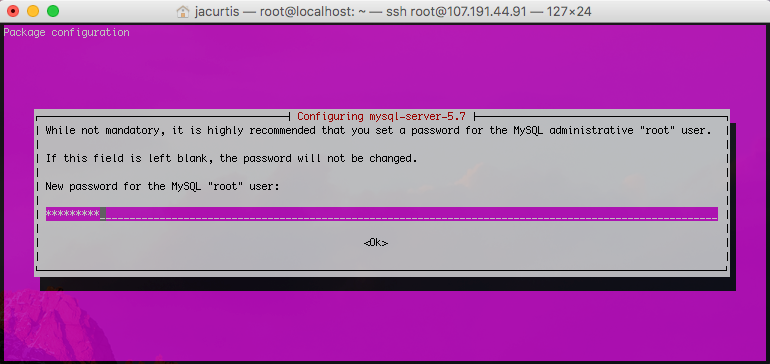

# How-To-Install-Nginx-on-Ubuntu

### Introduction

Nginx is one of the most popular web servers in the world and is responsible for hosting some of the largest and highest-traffic sites on the internet. It is more resource-friendly than Apache in most cases and can be used as a web server or reverse proxy.

In this guide, you’ll learn how to install Nginx on your Ubuntu 18.04 server and about important Nginx files and directories.

## Step 1 – Installing Nginx

Since Nginx is available in Ubuntu’s default repositories, it is possible to install it from these repositories using the apt packaging system.

Since this may be your first interaction with the apt packaging system in this session, update the local package index so that you have access to the most recent package listings. Afterward, you can install nginx:

```shell
$ sudo apt update
$ sudo apt install nginx
```

After accepting the procedure, apt will install Nginx and any required dependencies to your server.

## Step 2 – Adjusting the Firewall

Before testing Nginx, the firewall software needs to be adjusted to allow access to the service. Nginx registers itself as a service with ufw upon installation, making it straightforward to allow Nginx access.

List the application configurations that ufw knows how to work with by typing the following:

```shell
$ sudo ufw app list
```

Your output should be a list of the application profiles:

```console
Output
Available applications:
  Nginx Full
  Nginx HTTP
  Nginx HTTPS
  OpenSSH
```

This list displays three profiles available for Nginx:

- **Nginx Full:** This profile opens both port 80 (normal, unencrypted web traffic) and port 443 (TLS/SSL encrypted traffic)
- **Nginx HTTP:** This profile opens only port 80 (normal, unencrypted web traffic)
- **Nginx HTTPS:** This profile opens only port 443 (TLS/SSL encrypted traffic)

It is recommended that you enable the most restrictive profile that will still allow the traffic you’ve configured. Since you haven’t configured SSL for your server yet in this guide, you’ll only need to allow traffic on port 80.

You can enable this by typing the following:

```shell
$ sudo ufw allow 'Nginx HTTP'
```

Then, verify the change:

```shell
$ sudo ufw status
```

You should receive a list of HTTP traffic allowed in the output:

```console
Output
Status: active

To                         Action      From
--                         ------      ----
OpenSSH                    ALLOW       Anywhere
Nginx HTTP                 ALLOW       Anywhere
OpenSSH (v6)               ALLOW       Anywhere (v6)
Nginx HTTP (v6)            ALLOW       Anywhere (v6)
```

Now that you’ve added the appropriate firewall rule, you can check that your web server is running and able to serve content correctly.

## Step 3 – Checking your Web Server

t the end of the installation process, Ubuntu 18.04 starts Nginx. The web server should already be up and running.

Check with the `systemd` init system to make sure the service is running:

```shell
$ systemctl status nginx
```

```console
Output
● nginx.service - A high performance web server and a reverse proxy server
   Loaded: loaded (/lib/systemd/system/nginx.service; enabled; vendor preset: en
   Active: active (running) since Fri 2021-10-01 21:36:15 UTC; 35s ago
     Docs: man:nginx(8)
 Main PID: 9039 (nginx)
    Tasks: 2 (limit: 1151)
   CGroup: /system.slice/nginx.service
           ├─9039 nginx: master process /usr/sbin/nginx -g daemon on; master_pro
           └─9041 nginx: worker process
```

This output shows that the service has started successfully. However, the best way to test this is to actually request a page from Nginx.

When you have your server’s IP address, enter it into your browser’s address bar:

```console
http://your_server_ip
```

You should receive the default Nginx landing page:


## Step 4: Install MySQL

Ok, a server isn’t much use without a database. In fact our Laravel application is kind of a waste unless we have a database to store our information (otherwise why not make a single page app or plain old HTML?).

Of course you could always install another database, but we will be installing MySQL here. To get started, we need to use Apt-Get to go install the base Mysql Install.

```shell
$ sudo apt-get install mysql-server
```

This will start installing MySQL. Let the install run until a bright pink/purple screen pops up. This might just be the worst color selection for any terminal application ever, but there isn’t much we can do about it but to embrace it. You will want to type in a password to use for the root MySQL user. Choose something secure here and then click the `enter` key.

After you make your first password it will ask you to confirm. Obviously make sure they match. Also, this is a password you need to remember. So make sure you store the password somewhere safe or it is something you can remember. You will be using this password a lot going forward.

Once your command line finished and displays the root@localhost:~# line again, then you know you are complete with MySQL.

### Secure your

You know that friend that just has that reputation for being the person you can’t tell a secret to no matter what? Well MySQL has a reputation for being unsecure. It is not because it is unsecure itself, but because most people that set it up leave many default settings in place and the default settings are not secure at all. For example, on my local computer my MySQL doesn’t even have a password at all and the only user is root. This is ok because it is only on my local computer and because it doesn’t store anything important, but on your server this is a bad idea.

MySQL luckily has a nice helper script which gets rid of a lot of these bad habits that MySQL has. For example it makes sure you don’t have an empty password for your root user, it gets rid of the test database, and removes remote root user access. These setting changes will make your MySQL more secure. To get all these security fixes to take effect, just type this into the terminal:

```shell
$ sudo mysql_secure_installation
```

Depending on your version it might ask you to install the VALIDATE PASSWORD plugin. I personally don’t think this is necessary since I will have control over making new users and I will make sure the passwords are secure enough, so I will skip over this setting. (Type ‘N’).

```console
VALIDATE PASSWORD PLUGIN can be used to test passwords
and improve security. It checks the strength of password
and allows the users to set only those passwords which are
secure enough. Would you like to setup VALIDATE PASSWORD plugin?

Press y|Y for Yes, any other key for No:
```

Next it will ask you if you want to change the existing password for root user. If you just set a secure password in the last step then you can also skip this question by pressing any key (other than ‘Y’). If you left the password blank or set up a silly password (like ‘password’ or ‘1234’) then go ahead and change your password now.

Next it will ask you to remove an anonymous user. Type `Y` to remove the anonymous users, this is a major security risk.

Now it will ask if you want to Disallow root login remotely? and you should also select `N` for this.

Another prompt asks to Remove test database and access to it? This is a good idea to do, so type `Y` again for this.

It may also ask to reload privilege tables now? This is always a good idea, so type `Y` again.

The terminal will tell you All Done! With this announcement we now have a LEM stack, which really isn’t a think. But I thought you would like to know your progress as we just completed the M in LEMP with our MySQL instance. Now let’s finish it up and get the P.
